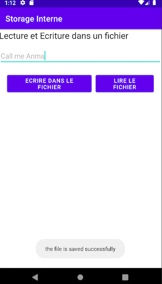
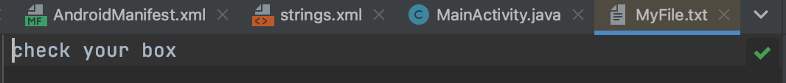

# Mini Android Application

## Description

the main goal of this application is to save data in the file text on the internal memory.

## Screens
### Main interface

### data stored
this data is stored in this path:
Device File Explorer->data->data->com.example.storageinterne->files->MyFile.txt

## Build

if you want to build this application. follow those steeps

Build -> Generated Signed Bundle / Apk -> click "APK" then next -> fill the form-> choose "debug" or "release" depend of your project state

